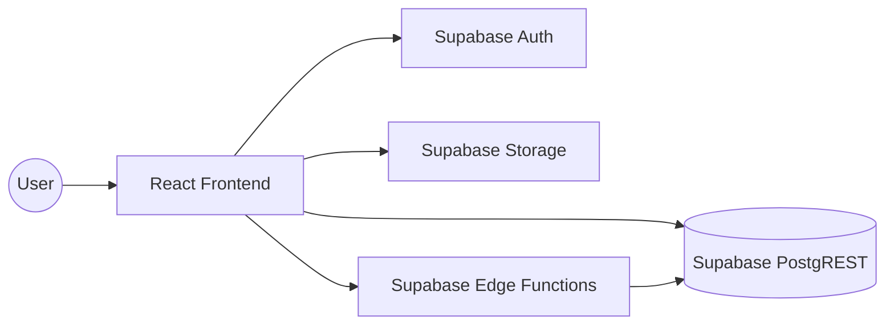

# Data Flow & Integrations

This document describes the lifecycle of data within the SGMU (Sistema de Gestão Municipal Urbana) platform, detailing how information originates, moves through the application layers, and persists in external services.

## High-Level Flow

The system follows a typical React/Supabase architecture where the frontend manages state and UI logic, while Supabase handles authentication, real-time database updates, and serverless logic.

1.  **Input**: Users interact via forms (Reservations, Profiles, Sign-up) or map interfaces.
2.  **Processing**: Frontend logic validates data and utilizes Context Providers (`AuthContext`, `CartContext`, `UserContext`) to manage local state.
3.  **Persistence**: Data is sent to Supabase via the `supabase-js` client.
4.  **Side Effects**: Database triggers or Edge Functions handle complex operations like order creation or automated notifications.

## Module Collaboration & Internal Movement

The application is structured into functional layers that collaborate to maintain a consistent data state:

### 1. State Management (Context API)
-   **AuthContext**: Manages the `user` session and `profile` data. It acts as the gatekeeper for `ProtectedRoute` and `GuestRoute`.
-   **CartContext**: Manages the selection of points/services before they are converted into a formal order. It persists session-based choices.
-   **UserContext**: Extends basic auth data with role-specific metadata (Admin, Technician, Client).

### 2. Component Interaction
-   **Page Components**: Act as data orchestrators. For example, `InstallationPipelinePage.jsx` fetches order data and passes it down to `OrderList.jsx`.
-   **UI Components**: Pure presentational components like `Modal.jsx` or `MobileFilterButton.jsx` receive data via props and emit events back up.

### 3. API & Service Layer
Direct API calls are often abstracted within components or contexts, but follow a pattern:
-   **Querying**: `supabase.from('table').select('*')` is used for fetching lists (points, orders, users).
-   **Filtering**: `FilterSheet.jsx` constructs query parameters to refine data sets.
-   **Mutations**: Actions like "Save Route" or "Update Profile" trigger specific `insert` or `update` calls.

## External Dependecies & IO

### Supabase
-   **Auth**: Handles signup, login, and password recovery.
-   **Database**: Stores `users`, `points`, `orders`, `routes`, etc.
-   **Storage**: Stores images (e.g., proof of completion photos, user avatars).

### Google Maps Platform
-   **Maps JavaScript API**: Renders the main map interface.
-   **Places API**: Assists with location search and autocompletion.
-   **Geocoding API**: Converts coordinates to addresses and vice versa.

## Critical Data Paths

### Authentication Flow
1.  User submits credentials in `Login.jsx`.
2.  `AuthProvider` calls `supabase.auth.signInWithPassword`.
3.  On success, session token is stored (localStorage).
4.  `AuthRedirectHandler` determines the appropriate dashboard based on user role.

### Order/Installation Flow
1.  User/Technician selects points in the map.
2.  Items added to `CartContext`.
3.  "Checkout" action groups items into an order.
4.  Order is inserted into Supabase `orders` table.
5.  Technicians view the new order in `InstallationPipelinePage`.

<!-- context-signature
{"timestamp":"2026-01-14T20:25:01.000Z","version":"1","generator":"ai-coders-context"}
-->
<!--
Semantic Context Analysis:
- `AdminLayout` (exported) @ src\components\admin\AdminLayout.jsx:7
- `AppLayout` (exported) @ src\components\AppLayout.jsx:4
- `AuthProvider` (exported) @ src\contexts\AuthContext.jsx:6
- `AuthRedirectHandler` (exported) @ src\components\AuthRedirectHandler.jsx:6
- `CartModal` (exported) @ src\components\CartModal.jsx:4
- `CartProvider` (exported) @ src\contexts\CartContext.jsx:7
- `cn` (exported) @ src\lib\utils.js:4
- `compressImage` (exported) @ src\lib\image-utils.js:12
- `FilterSheet` (exported) @ src\components\FilterSheet.jsx:10
- `formatCurrencyBRL` (exported) @ src\lib\utils.js:43
- `generateOptimizedRouteUrl` (exported) @ src\lib\maps-utils.js:73
- `getOrderStatusProps` (exported) @ src\lib\utils.js:13
- `GlobalCart` (exported) @ src\components\GlobalCart.jsx:10
- `GoogleMapsLoaderProvider` (exported) @ src\contexts\GoogleMapsLoaderContext.jsx:10
- `GuestRoute` (exported) @ src\components\GuestRoute.jsx:6
- `InstallationPipelinePage` (exported) @ src\pages\InstallationPipelinePage.jsx:4
- `ManageUsersPage` (exported) @ src\pages\ManageUsersPage.jsx:12
- `MapConfigProvider` (exported) @ src\contexts\MapConfigContext.jsx:10
- `MobileFilterButton` (exported) @ src\components\MobileFilterButton.jsx:4
- `Modal` (exported) @ src\components\Modal.jsx:6
- `OrderDetailPage` (exported) @ src\pages\OrderDetailPage.jsx:29
- `OrderList` (exported) @ src\components\\OrderList.jsx:19
- `PrintableOrder` (exported) @ src\components\PrintableOrder.jsx:4
- `PrintablePointsReport` (exported) @ src\components\PrintablePointsReport.jsx:4
- `ProtectedRoute` (exported) @ src\components\ProtectedRoute.jsx:7
- `RouteGenerator` (exported) @ src\components\RouteGenerator.jsx:12
- `RoutePlannerModal` (exported) @ src\components\RoutePlannerModal.jsx:12
- `SettingsManager` (exported) @ src\components\admin\SettingsManager.jsx:8
-->
